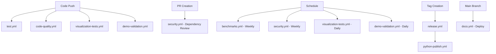

# GitHub Actions Workflows

This directory contains automated workflows for the ELES (Extinction-Level Event Simulator) project. These workflows ensure code quality, run tests, build documentation, and automate various aspects of the development and release process.

## Available Workflows

### 🧪 Testing & Quality Assurance

#### 1. `test.yml` - Automated Testing

- **Triggers:** Push/PR to main/develop branches
- **Purpose:** Runs comprehensive test suite across multiple Python versions
- **Features:**
  - Multi-version Python testing (3.8, 3.9, 3.10, 3.11)
  - Code coverage reporting with Codecov integration
  - Caching for faster builds
  - Installation and quick test validation

#### 2. `code-quality.yml` - Code Quality Checks

- **Triggers:** Push/PR to main/develop branches
- **Purpose:** Ensures code quality and consistency
- **Features:**
  - Linting with flake8
  - Code formatting checks with black
  - Import sorting validation with isort
  - Type checking with mypy
  - Security scanning with bandit

#### 3. `visualization-tests.yml` - Visualization Validation

- **Triggers:** Push/PR + daily at 2 AM UTC
- **Purpose:** Tests all visualization components and demos
- **Features:**
  - Headless visualization testing with xvfb
  - All demo validations (basic, scientific, comparative, advanced)
  - 3D model and network visualization tests
  - Artifact collection for generated outputs

#### 4. `demo-validation.yml` - Demo & Example Validation

- **Triggers:** Push/PR + daily at 6 AM UTC
- **Purpose:** Validates all demos, examples, and CLI functionality
- **Features:**
  - Installation test validation
  - CLI functionality testing
  - Individual module import validation
  - Core engine testing
  - Comprehensive demo suite validation

### 📊 Performance & Monitoring

#### 5. `benchmarks.yml` - Performance Benchmarking

- **Triggers:** Push/PR to main + weekly on Saturdays
- **Purpose:** Monitors performance and resource usage
- **Features:**
  - Simulation performance benchmarks
  - Visualization rendering performance
  - Memory usage tracking
  - System information reporting

### 🔒 Security & Dependencies

#### 6. `security.yml` - Security & Dependency Management

- **Triggers:** Push/PR to main + weekly on Mondays
- **Purpose:** Security scanning and dependency management
- **Features:**
  - Security vulnerability scanning with Safety and pip-audit
  - Dependency review for PRs
  - Automated dependency updates
  - Outdated package detection

### 📚 Documentation

#### 7. `docs.yml` - Documentation Build & Deploy

- **Triggers:** Push/PR to main
- **Purpose:** Builds and deploys project documentation
- **Features:**
  - Sphinx documentation generation
  - API documentation auto-generation
  - GitHub Pages deployment
  - Documentation artifact collection

### 🚀 Release & Distribution

#### 8. `release.yml` - Release Automation

- **Triggers:** Git tags matching `v*`
- **Purpose:** Automates release process
- **Features:**
  - Automatic changelog generation
  - GitHub release creation
  - PyPI package publishing
  - Docker image building and publishing
  - Asset uploading

#### 9. `python-publish.yml` - PyPI Publishing (Existing)

- **Triggers:** Release events
- **Purpose:** Publishes packages to PyPI
- **Features:**
  - Package building and validation
  - PyPI upload automation

## Workflow Dependencies

## Required Secrets

To use all workflows effectively, configure these secrets in your repository:

### Required Secrets

- `PYPI_API_TOKEN` - For PyPI package publishing
- `GITHUB_TOKEN` - Automatically provided by GitHub

### Optional Secrets

- `CODECOV_TOKEN` - For enhanced Codecov integration
- Personal access tokens for enhanced automation

## Workflow Configuration

### Branch Protection

Recommended branch protection rules for `main`:

- Require status checks: `test`, `code-quality`, `visualization-tests`
- Require up-to-date branches
- Require PR reviews

### Artifacts

Workflows generate various artifacts:

- Test coverage reports
- Security scan results
- Performance benchmarks
- Documentation builds
- Visualization outputs

## Customization

### Environment Variables

Key environment variables used:

- `PYTHONPATH` - Ensures proper module imports
- `MPLBACKEND=Agg` - Headless matplotlib backend
- `CODECOV_TOKEN` - Code coverage reporting

### Workflow Triggers

Modify trigger conditions in workflow files:

- Change schedule timing with cron expressions
- Adjust branch patterns for different workflows
- Enable/disable specific triggers as needed

## Troubleshooting

### Common Issues

1. **Import Errors**: Ensure `PYTHONPATH` is set correctly
2. **Visualization Tests**: May require `xvfb` for headless testing
3. **Permission Issues**: Check repository secrets and permissions
4. **Cache Issues**: Clear GitHub Actions cache if builds behave unexpectedly

### Debug Mode

Enable workflow debugging by setting repository secret:

- `ACTIONS_STEP_DEBUG: true`
- `ACTIONS_RUNNER_DEBUG: true`

## Monitoring

### Workflow Status

Monitor workflow health via:

- GitHub Actions tab
- Status badges in README
- Email notifications (configurable)
- Third-party monitoring tools

### Performance Tracking

- Benchmark results in artifacts
- Build time tracking
- Resource usage monitoring
- Success/failure rate analysis

---

For questions or issues with workflows, please open an issue with the `workflow` label.
